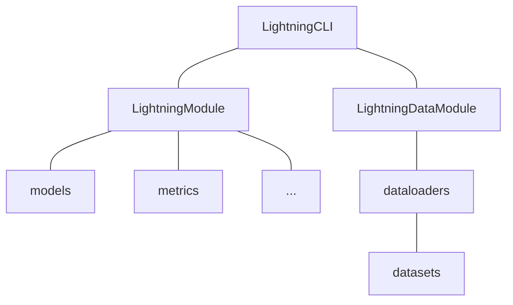

<div align="center">

# Pytorch Lightning Template

[](https://pytorch.org/get-started/locally/)
[](https://lightning.ai/docs/pytorch/stable/)
[](https://github.com/astral-sh/ruff)
[](./LICENSE)

A template for simple deep learning projects using Lightning

English | [中文](./README_ZH.md)

</div>

## Introduction

[PyTorch Lightning](https://lightning.ai/docs/pytorch/stable/) is to deep learning project development as [MVC](https://en.wikipedia.org/wiki/Model%E2%80%93view%E2%80%93controller) frameworks (such as [Spring](https://spring.io/), [Django](https://www.djangoproject.com/), etc.) are to website development. While it is possible to implement everything from scratch and achieve maximum flexibility (especially since [PyTorch](https://pytorch.org/) and its ecosystem are already quite straightforward), using a framework can help you quickly implement prototypes with guidance from ["best practices"](#best-practice) (personal opinion) to save a lot of boilerplate code through re-usability, and focus on scientific innovation rather than engineering challenges. This template is built using the full Lightning suite, follows the principle of [Occam's razor](https://en.wikipedia.org/wiki/Occam%27s_razor), and is friendly to researchers. It also includes a simple handwritten digit recognition task using the MNIST dataset. The repository also contains some [Tips](#tips), for reference.

## "Best Practice"

### Using [Pytorch Lightning](https://lightning.ai/docs/pytorch/stable/) as a deep learning framework:

Most of the deep learning code can be divided into the following three parts([Reference [Chinese]](https://zhuanlan.zhihu.com/p/120331610)):

1. Research code: This part pertains to the model and generally deals with customizations of the model's structure and training. In `Lightning`, this code is abstracted as the `pl.LightningModule` class. While dataset definition can also be included in this part, it is not recommended as it is not relevant to the experiment and should be included in `pl.LightningDataModule` instead.

2. Engineering code: This part of the code is essential for its high repeatability, such as setting early stopping, 16-bit precision, and GPU distributed training. In `Lightning`, this code is abstracted as the `pl.Trainer` class.

3. Non-essential code: This code is helpful in conducting experiments but is not directly related to the experiment itself, and can even be omitted. For example, gradient checking and outputting logs to `TensorBoard`. In Lightning, this code is abstracted as the `Callbacks` class, which is registered to `pl.Trainer`.

The advantages of using `Lightning`:

1. Custom training processes and learning rate adjustment strategies can be implemented through various [hook functions](https://lightning.ai/docs/pytorch/stable/common/lightning_module.html#hooks) in `pl.LightningModule`.

2. The model and data no longer need to be explicitly designated for devices (`tensor.to`, `tensor.cuda`, etc.). `pl.Trainer` handles this automatically, thereby supporting various [acceleration devices such as CPU, GPU, and TPU](https://lightning.ai/docs/pytorch/latest/extensions/accelerator.html).

3. `pl.Trainer` implements various [training strategies](https://lightning.ai/docs/pytorch/latest/extensions/strategy.html), such as automatic mixed precision training, multi-GPU training, and distributed training.

4. `pl.Trainer` implements multiple [callbacks](https://lightning.ai/docs/pytorch/latest/extensions/callbacks.html) such as automatic model saving, automatic config saving, and automatic visualization result saving.

### Using [Pytorch Lightning CLI](https://lightning.ai/docs/pytorch/stable/cli/lightning_cli.html#lightning-cli) as a command-line tool:

1. Using `lightning_cli` as the program entry point, model, data, and training parameters can be set through configuration files or command-line parameters, thereby achieving quick switching between multiple experiments.

2. `pl.LightningModule.save_hyperparameters()` saves the model's hyperparameters and automatically generates a command-line parameter table, eliminating the need for tools such as [`argparse`](https://docs.python.org/3/library/argparse.html) or [`hydra`](https://hydra.cc/).

### Using [Torchmetrics](https://torchmetrics.readthedocs.io/en/stable/) as a metric computation tool:

1. `Torchmetrics` provides multiple metric calculation methods such as `Accuracy`, `Precision`, and `Recall`.

2. It is integrated with `Lightning` and is compatible with parallel training strategies. Data is automatically aggregated to the main process for metric computation.

### [Optional] Using [WanDB](https://wandb.ai/) to track experiments

### Project Architecture



### File Structure

```text
├── configs                  # Configuration files
│   ├── data                 # Dataset configuration
│   │   └── mnist.yaml       # Example configuration for MNIST dataset
│   ├── model                # Model configuration
│   │   └── simplenet.yaml   # Example configuration for SimpleNet model
│   └── default.yaml         # Default configuration
├── data                     # Dataset directory
├── logs                     # Log directory
├── notebooks                # Jupyter Notebook directory
├── scripts                  # Script directory
│   └── clear_wandb_cache.py # Example script to clear wandb cache
├── src                      # Source code directory
│   ├── callbacks            # Callbacks directory
│   │   └── __init__.py
│   ├── data_modules         # Data module directory
│   │   ├── __init__.py
│   │   └── mnist.py         # Example data module for MNIST dataset
│   ├── metrics              # Metrics directory
│   │   └── __init__.py
│   ├── models               # Model directory
│   │   ├── __init__.py
│   │   └── simplenet.py     # Example SimpleNet model
│   ├── modules              # Module directory
│   │   ├── __init__.py
│   │   └── mnist_module.py  # Example MNIST module
│   ├── utils                # Utility directory
│   │   ├── __init__.py
│   │   └── cli.py           # CLI tool
│   ├── __init__.py
│   └── main.py              # Main program entry point
├── .env.example             # Example environment variable file
├── .gitignore               # Ignore files for git
├── .project-root            # Project root indicator file for pyrootutils
├── LICENSE                  # Open source license
├── pyproject.toml           # Configuration file for Black and Ruff
├── README.md                # Project documentation
├── README_PROJECT.md        # Project documentation template
├── README_ZH.md             # Project documentation in Chinese
└── requirements.txt         # Dependency list
```

## Usage

### Installation

```bash
# Clone project
git clone https://github.com/DavidZhang73/pytorch-lightning-template <project_name>
cd <project_name>

# [Optional] Create a conda virtual environment
conda create -n <env_name> python=<3.8|3.9|3.10>
conda activate <env_name>

# [Optional] Use mamba instead of conda to speed up
conda install mamba -n base -c conda-forge

# [Optional] Install PyTorch according to the website to get GPU support
# https://pytorch.org/get-started/

# Install dependencies
pip install -r requirements.txt
```

### Configuration

1. Define dataset by inheriting `pl.LightningDataModule` in `src/data_module`.
2. Define dataset configuration file in `configs/data` as parameters for the custom `pl.LightningDataModule`.
3. Define the model by inheriting `nn.Module` in `src/models`.
4. Define metrics by inheriting `torchmetrics.Metric` in `src/metrics`.
5. Define training module by inheriting `pl.LightningModule` in `src/modules`.
6. Define the configuration file for the training module in `configs/model` as parameters for the custom `pl.LightningModule`.
7. Configure `pl.trainer`, logs and other parameters in `configs/default.yaml`.

### Run

**Fit**

```bash
python src/main.py fit -c configs/data/mnist.yaml -c configs/model/simplenet.yaml --trainer.logger.name exp1
```

**Validate**

```bash
python src/main.py validate -c configs/data/mnist.yaml -c configs/model/simplenet.yaml --trainer.logger.name exp1
```

**Test**

```bash
python src/main.py test -c configs/data/mnist.yaml -c configs/model/simplenet.yaml --trainer.logger.name exp1
```

**Inference**

```bash
python src/main.py predict -c configs/data/mnist.yaml -c configs/model/simplenet.yaml --trainer.logger.name exp1
```

**Debug**

```bash
python src/main.py fit -c configs/data/mnist.yaml -c configs/model/simplenet.yaml --trainer.fast_dev_run true
```

**Resume**

```bash
python src/main.py fit -c configs/data/mnist.yaml -c configs/model/simplenet.yaml --ckpt_path <ckpt_path> --trainer.logger.id exp1_id
```

## Tips

### `print_config`

Using the `print_config` functionality of `jsonargparse`, you can obtain the parsed arguments and generate default `yaml` files. However, it is necessary to first configure the `yaml` files for `data` and `model`.

```bash
python src/main.py fit -c configs/data/mnist.yaml -c configs/model/simplenet.yaml --print_config
```

[Prepare a config file for the CLI](https://lightning.ai/docs/pytorch/stable/cli/lightning_cli_advanced.html#prepare-a-config-file-for-the-cli)

### Customized `LightningCLI`

This template implements a custom `CLI` (`CustomLightningCLI`) to achieve the following functions,

- When starting the program, the configuration file is automatically saved to the corresponding log directory, for `WandbLogger` only.
- When starting the program, save configurations for optimizer and scheduler to loggers.
- When starting the program, the default configuration file is automatically loaded.
- After the test is completed, the `checkpoint_path` used for testing is printed.
- Add some command line parameters:
    - `--ignore_warnings` (default: `False`): Ignore all warnings.
    - `--test_after_fit` (default: `False`): Automatically test after each training.
    - `--git_commit_before_fit` (default: `False`): `git commit` before each training, the commit message is `{logger.name}_{logger.version}`, for `WandbLogger` only.

[CONFIGURE HYPERPARAMETERS FROM THE CLI (EXPERT)](https://lightning.ai/docs/pytorch/stable/cli/lightning_cli_expert.html)

### Limit `numpy` number of threads

When running on a server, especially when the CPU has a lot of cores (>=24), you may encounter the problem of too many `numpy` processes, which may cause the experiment to inexplicably hang. You can limit the number of `numpy` processes by setting environment variables (in the `.env` file).

```text
OMP_NUM_THREADS=8
MKL_NUM_THREADS=8
GOTO_NUM_THREADS=8
NUMEXPR_NUM_THREADS=8
OPENBLAS_NUM_THREADS=8
MKL_DOMAIN_NUM_THREADS=8
VECLIB_MAXIMUM_THREADS=8
```

> `.env` file is automatically loaded to environment by [`pyrootutils`](https://github.com/ashleve/pyrootutils) via [`python-dotenv`](https://github.com/theskumar/python-dotenv).

[Stack Overflow: Limit number of threads in numpy](https://stackoverflow.com/questions/30791550/limit-number-of-threads-in-numpy)

### Clear `wandb` cache

When you delete an experiment from the `wandb` web page, the cache of the experiment still exists in the local `wandb` directory, you can use the `scripts/clear_wandb_cache.py` script to clear the cache.

[Wandb Python Documentation](https://docs.wandb.ai/ref/python/)

## References

Inspired by,

- [deep-learning-project-template](https://github.com/Lightning-AI/deep-learning-project-template)
- [lightning-hydra-template](https://github.com/ashleve/lightning-hydra-template)
