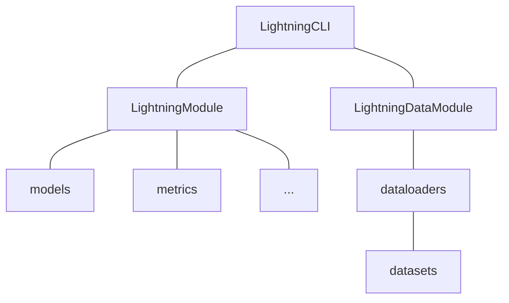

<div align="center">

# Pytorch Lightning Template

[](https://pytorch.org/get-started/locally/)
[](https://lightning.ai/docs/pytorch/stable/)
[](https://github.com/astral-sh/ruff)
[](./LICENSE)

一个使用Lightning全家桶的简单深度学习项目模板

[English](./README.md) | 中文

</div>

## 介绍

[Pytorch Lightning](https://lightning.ai/docs/pytorch/stable/)之于深度学习项目开发就如同[MVC](https://en.wikipedia.org/wiki/Model%E2%80%93view%E2%80%93controller)框架（例如[Spring](https://spring.io/)，[Django](https://www.djangoproject.com/)等）之于网站开发。你当然可以手写所有实现并获得最大的灵活度（尤其是[PyTorch](https://pytorch.org/)及其生态已经足够简单），但使用框架能够帮助你在已有[“最佳实践”](#最佳实践)（仅代表个人观点）的指导下快速实现原型，通过复用省去大量模板代码（boilerplate），从而专注于科研创新而不是工程难题。该模板使用`lightning`全家桶构建，尽量遵循[奥卡姆剃刀原则](https://zh.wikipedia.org/zh-hans/%E5%A5%A5%E5%8D%A1%E5%A7%86%E5%89%83%E5%88%80)以及对科研人员友好，并实现了一个简单的手写数字识别任务[MNIST](https://en.wikipedia.org/wiki/MNIST_database)。该仓库还记录了一些在使用过程中的[Tips](#tips)，以供参考。

## “最佳实践”

### 使用 [Pytorch Lightning](https://lightning.ai/docs/pytorch/stable/) 作为深度学习框架

大部分的深度学习的代码都可以分为以下这三部分（[参考](https://zhuanlan.zhihu.com/p/120331610)）：

1. 研究代码（Research code）
   这部分属于模型部分，一般处理模型的结构、训练等定制化部分。在`Linghtning`中，这部分代码抽象为 `pl.LightningModule`类。数据集的定义也可以放在这里，但是不推荐，因为这部分代码和实验无关，应该放在`pl.LightningDataModule`中
2. 工程代码（Engineering code）
   这部分代码很重要的特点是：重复性强，比如说设置 Early Stopping、16 位精度、GPU 分布训练。在`Linghtning`中，这部分抽象为`pl.Trainer`类
3. 非必要代码（Non-essential code）
   这部分代码有利于实验的进行，但是和实验没有直接关系，甚至可以不使用。比如说检查梯度、给`TensorBoard`输出log。在`Linghtning`中，这部分抽象为`Callbacks`类，注册到`pl.Trainer`

`Lightning`的优势有：

1. 通过`pl.LightningModule`中的各种[钩子函数（hook）](https://lightning.ai/docs/pytorch/stable/common/lightning_module.html#hooks)，可以实现自定义的训练过程，自定义的学习率调整策略等
2. 模型和数据不再需要显式地指定设备（`tensor.to`，`tensor.cuda`等），`pl.Trainer`会自动处理，从而支持各种[加速设备（CPU，GPU，TPU 等）](https://lightning.ai/docs/pytorch/latest/extensions/accelerator.html)
3. `pl.Trainer`实现了多种[训练策略](https://lightning.ai/docs/pytorch/latest/extensions/strategy.html)，如自动混合精度训练，多卡训练，分布式训练等
4. `pl.Trainer`实现了多种[回调（callback）](https://lightning.ai/docs/pytorch/latest/extensions/callbacks.html)，如自动保存模型，自动保存日志，自动保存可视化结果等

### 使用 [Pytorch Lightning CLI](https://lightning.ai/docs/pytorch/stable/cli/lightning_cli.html#lightning-cli) 作为命令行工具

1. 使用`lightning_cli`作为程序入口，可以通过配置文件或命令行参数设置模型、数据、训练等参数，从而实现多个实验的快速切换
2. 使用`pl.LightningModule.save_hyperparameters()`保存模型的超参数，自动生成命令行参数表，无需用[`argparse`](https://docs.python.org/3/library/argparse.html)或[`hydra`](https://hydra.cc/)等工具手动实现

### 使用 [Torchmetrics](https://torchmetrics.readthedocs.io/en/stable/) 作为指标计算工具

1. 自带了多种指标计算方法，如`Accuracy`，`Precision`，`Recall`等
2. 与`Lightning`集成，兼容并行训练策略，数据自动汇集到主进程计算指标

### [可选] 使用[WanDB](https://wandb.ai/)来记录实验日志

### 项目架构



### 文件结构

```text
.
├── configs                  # 配置文件
│   ├── data                 # 数据集配置
│   │   └── mnist.yaml       # MNIST数据集配置示例
│   ├── model                # 模型配置
│   │   └── simplenet.yaml   # SimpleNet模型配置示例
│   └── default.yaml         # 默认配置
├── data                     # 数据集目录
├── logs                     # 日志目录
├── notebooks                # Jupyter Notebook目录
├── scripts                  # 脚本目录
│   └── clear_wandb_cache.py # 清除wandb缓存脚本示例
├── src                      # 源代码目录
│   ├── callbacks            # 回调函数目录
│   │   └── __init__.py
│   ├── data_modules         # 数据集模块目录
│   │   ├── __init__.py
│   │   └── mnist.py         # MNIST数据集模块示例
│   ├── metrics              # 指标目录
│   │   └── __init__.py
│   ├── models               # 模型目录
│   │   ├── __init__.py
│   │   └── simplenet.py     # SimpleNet模型示例
│   ├── modules              # 模块目录
│   │   ├── __init__.py
│   │   └── mnist_module.py  # MNIST模块示例
│   ├── utils                # 工具目录
│   │   ├── __init__.py
│   │   └── cli.py           # CLI工具
│   ├── __init__.py
│   └── main.py              # 程序主入口
├── .env.example             # 环境变量示例
├── .gitignore               # Git忽略列表
├── .project-root            # pyrootutils项目根目录指示文件
├── LICENSE                  # 开源协议
├── pyproject.toml           # Black和Ruff的配置文件
├── README_PROJECT.md        # 项目说明模板
├── README.md                # 本项目说明
├── README_ZH.md             # 本项目说明（中文）
└── requirements.txt         # 依赖列表
```

## 使用

### 安装

```bash
# 克隆项目
git clone https://github.com/DavidZhang73/pytorch-lightning-template <project_name>
cd <project_name>

# [可选] 创建conda虚拟环境
conda create -n <env_name> python=<3.8|3.9|3.10>
conda activate <env_name>

# [可选] 使用mamba而不是conda
conda install mamba -n base -c conda-forge

# [可选] 根据官网教程安装pytorch以支持GPU加速等
# https://pytorch.org/get-started/

# 安装依赖
pip install -r requirements.txt
```

### 配置

1. 在`src/data_module`中继承[`pl.LightningDataModule`](https://lightning.ai/docs/pytorch/stable/data/datamodule.html)定义数据集
2. 在`configs/data`中定义数据集的配置文件(作为自定义的`pl.LightningDataModule`的参数)
3. 在`src/models`中继承`nn.Module`定义模型
4. 在`src/metrics`中继承[`torchmetrics.Metric`](https://torchmetrics.readthedocs.io/en/stable/pages/implement.html)定义指标
5. 在`src/modules`中继承[`pl.LightningModule`](https://lightning.ai/docs/pytorch/stable/common/lightning_module.html)定义训练模块
6. 在`configs/model`中定义训练模块的配置文件(作为自定义的`pl.LightningModule`的参数)
7. 配置`configs/default.yaml`中的[`pl.trainer`](https://lightning.ai/docs/pytorch/stable/common/pl.trainer.html)，日志等参数

### 运行

**训练**

```bash
python src/main.py fit -c configs/data/mnist.yaml -c configs/model/simplenet.yaml --trainer.logger.name exp1
```

**验证**

```bash
python src/main.py validate -c configs/data/mnist.yaml -c configs/model/simplenet.yaml --trainer.logger.name exp1
```

**测试**

```bash
python src/main.py test -c configs/data/mnist.yaml -c configs/model/simplenet.yaml --trainer.logger.name exp1
```

**推理**

```bash
python src/main.py predict -c configs/data/mnist.yaml -c configs/model/simplenet.yaml --trainer.logger.name exp1
```

**调试**

```bash
python src/main.py fit -c configs/data/mnist.yaml -c configs/model/simplenet.yaml --trainer.fast_dev_run true
```

**恢复训练**

```bash
python src/main.py fit -c configs/data/mnist.yaml -c configs/model/simplenet.yaml --ckpt_path <ckpt_path> --trainer.logger.id exp1_id
```

## Tips

### 获得解析的参数，生成默认`yaml`文件

利用`jsonargparse`的`print_config`功能，可以获得解析的参数，生成默认`yaml`文件等，不过需要先配置好`data`和`model`的`yaml`文件，

```bash
python src/main.py fit -c configs/data/mnist.yaml -c configs/model/simplenet.yaml --print_config
```

[Prepare a config file for the CLI](https://lightning.ai/docs/pytorch/stable/cli/lightning_cli_advanced.html#prepare-a-config-file-for-the-cli)

### 自定义`LightningCLI`

该模板实现了一个自定义的`CLI`(`CustomLightningCLI`)以实现以下功能，

- 每次启动时，自动保存配置文件到对应的日志文件目录下, 仅实现了对`WandbLogger`的适配
- 每次启动时，把`optimizer`和`lr_scheduler`的参数保存到`Loggers`中
- 每次启动时，自动加载默认配置文件
- 测试完成后，打印测试使用的`checkpoint_path`
- 添加了一些命令行参数：
    - `--ignore_warnings`（默认： `False`）：忽略全部警告
    - `--test_after_fit`（默认： `False`）：每次训练完成后，自动测试一遍
    - `--git_commit_before_fit`（默认： `False`）：每次训练之前`git commit`一下，`commit`的信息为`{logger.name}_{logger.version}`, 仅实现了对`WandbLogger`的适配

[CONFIGURE HYPERPARAMETERS FROM THE CLI (EXPERT)](https://lightning.ai/docs/pytorch/stable/cli/lightning_cli_expert.html)

### 限制`numpy`的进程数量

当运行在服务器上，尤其是CPU拥有很多核（>=24）时，可能遇到`numpy`的进程数量过多的问题，可能导致实验莫名其妙卡死，可以设置环境变量的方式（在`.env`文件中）限制`numpy`的进程数量。

```text
OMP_NUM_THREADS=8
MKL_NUM_THREADS=8
GOTO_NUM_THREADS=8
NUMEXPR_NUM_THREADS=8
OPENBLAS_NUM_THREADS=8
MKL_DOMAIN_NUM_THREADS=8
VECLIB_MAXIMUM_THREADS=8
```

> `.env`文件由[`pyrootutils`](https://github.com/ashleve/pyrootutils)库通过[`python-dotenv`](https://github.com/theskumar/python-dotenv)自动加载到环境变量中

[Stack Overflow: Limit number of threads in numpy](https://stackoverflow.com/questions/30791550/limit-number-of-threads-in-numpy)

### 清除`wandb`的缓存

当你从`wandb`的网页上删除了一个实验，但是本地的`wandb`目录下仍然存在该实验的缓存时，可以使用脚本`scripts/clear_wandb_cache.py`清除缓存。

[Wandb Python Documentation](https://docs.wandb.ai/ref/python/)

## 参考

灵感来源于

- [deep-learning-project-template](https://github.com/Lightning-AI/deep-learning-project-template)
- [lightning-hydra-template](https://github.com/ashleve/lightning-hydra-template)
